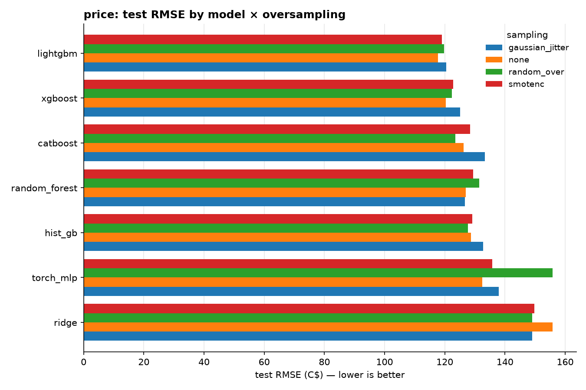
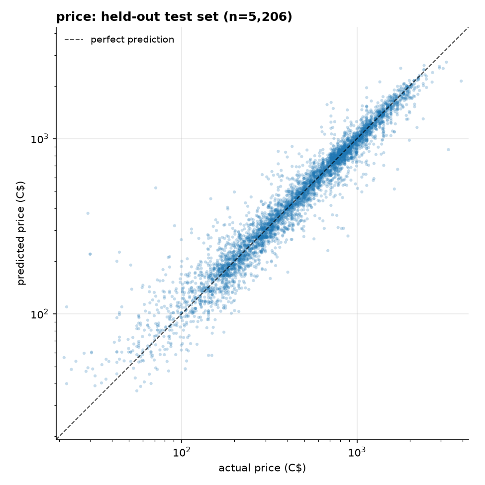

# eBay iPhone Price Prediction

[](.github/workflows/ci.yml)
[](pyproject.toml)
[](deploy/go)
[](Dockerfile)
[](LICENSE)

**What a used iPhone actually sells for — an end-to-end ML system trained on
real eBay sold prices, not asking prices.**

- 📱 **30k+ sold listings scraped** — every iPhone from 8 to 17, X-gen, e-models, Air
- 🎯 **MAE ≈ C$62 at R² 0.94** — every prediction ships with a calibrated 80% price band
- 🏁 **56-fit GPU sweep** — 7 model families × 4 oversampling strategies, winner auto-tuned
- ⚡ **Two servers, one truth** — FastAPI, or Go + ONNX that hard-fails on drift from python
- ☁️ **One-command deploys** — Docker Compose, AWS (ECR + App Runner), K8s with autoscaling

```
scrape ──> clean ──> train ──> export ──> serve
  │          │         │          │         │
  data/raw   data/     reports/   ONNX +    FastAPI ─ Docker ─ AWS
  (CSV)      processed artifacts  serving.json  Go ─ Docker ─ K8s/EKS
```

## Quickstart

```bash
python -m venv .venv && . .venv/Scripts/activate     # or bin/activate on Linux
pip install -e .[scrape,train,dev]
# GPU torch for the MLP candidate (optional; match your CUDA toolkit):
pip install torch --index-url https://download.pytorch.org/whl/cu121

python -m ebay_price.scrape          # sold listings -> data/raw/ebay_iphone_sold_<date>.csv
python -m ebay_price.clean           # all sold CSVs -> data/processed/listings.csv
python -m ebay_price.train           # reports/* + artifacts/*.joblib  (--no-gpu to force CPU)
uvicorn ebay_price.api:app --port 8000
```

Re-running scrape + clean on later dates accumulates history: clean.py
concatenates every `ebay_iphone_sold_*.csv` and dedupes by listing id.
`python -m ebay_price.scrape --active` grabs live asking prices instead
(not used for training).

### API

```bash
curl -X POST http://localhost:8000/predict -H "Content-Type: application/json" -d '{
  "condition": "Pre-Owned",
  "model": "13",
  "storage_gb": 128,
  "carrier_status": "Unlocked",
  "battery_health_pct": 87
}'
# {"predicted_price_cad": 279.88, "price_range_cad": [230.58, 340.49],
#  "predicted_shipping_cad": 2.34, "shipping_range_cad": [0.52, 6.76],
#  "trained_on": "2026-07-07"}
```

The range is an 80% prediction band (see Training below). Omitted seller
fields default to marketplace medians, so the answer prices a typical sale —
pass `"seller_feedback_count": 0` to price a no-history seller instead
(those genuinely clear ~25% lower). Interactive docs at `/docs`, liveness
at `/health`.

## How it works

**Scraping** (`scrape.py`) — polite session against eBay.ca sold/completed
search results, one query per iPhone family (240 listings/page, jittered
delays, retry with fresh cookies, per-page CSV flush, stops when pagination
repeats). Parses the `s-card` markup: title, condition, price, shipping,
seller feedback, product stars, item location, sold date. Sold results
include ended auctions — their final bid is a real price, so no Buy-It-Now
filter in sold mode.

**Why sold listings?** Asking prices for used phones are dominated by
listings that never sell — identical configs get listed anywhere from C$139
to C$1,420, and no model can learn from labels like that. Sold prices are
market clearing prices; they are the label the models should see.

**Cleaning** (`clean.py`) — drops non-phone results (accessories, multi-device
lots, damaged units), extracts `model` / `storage_gb` / `carrier_status` /
`battery_health_pct` / `sealed` from titles, parses C$ prices and sold dates,
and applies junk guards: price C$20–4000, sales older than 12 months dropped
(price drift), cross-border shipping quotes above C$500 nulled (freight junk —
87% of sold listings ship from the US, so C$35–270 quotes are real). Titles
naming several models ("iPhone 12/12 Pro") are dropped as ambiguous;
multi-storage titles ("64GB/128GB") keep min storage, matching eBay's
cheapest-variant price display. Every filter step is logged as a funnel
(31,875 raw → 26,027 modeling rows on 2026-07-07).

**Training** (`train.py`) — one end-to-end sklearn `Pipeline` per target
(impute + scale numerics, one-hot categoricals, model), fit on
**log1p(price)** since prices are right-skewed. The full sweep compares:

- models: Ridge, RandomForest, HistGradientBoosting, XGBoost (CUDA),
  LightGBM, CatBoost (CUDA), PyTorch MLP (CUDA)
- oversampling for imbalanced regression (rare = sparse target ranges,
  equal-width bins, partial 3× balancing): `none`, `random_over`,
  `smotenc` (SMOTER-style with the target riding along), `gaussian_jitter`
  (SMOGN-style noise on duplicated rows)

The winner per target is tuned with `RandomizedSearchCV`, compared against
the sweep defaults on the held-out test set (CV on resampled folds is
optimistically biased), and saved as a single joblib artifact that takes
**raw listing fields** in. **80% prediction bands** come from P10/P90
quantiles of out-of-fold residuals in log1p space (split-conformal style),
stored as two offsets in `metadata.json` — no extra model.

## Results (sold listings scraped 2026-07-07, 26,027 rows)

| target   | best model       | best sampling | RMSE (C$) | MAE (C$) |   R² | 80% band coverage |
|----------|------------------|---------------|----------:|---------:|-----:|------------------:|
| price    | LightGBM (tuned) | none          |    115.65 |    61.61 | 0.94 |             81.5% |
| shipping | XGBoost          | random_over   |     70.27 |    47.56 | 0.56 |             78.5% |

R² 0.94 partly reflects the wide scope (an iPhone 8 vs 17 Pro Max spread is
easy to predict), so the honest per-segment view is test MAE by family —
roughly 10–13% of each family's median sold price across the range:

| family | median C$ | MAE C$ | | family | median C$ | MAE C$ |
|--------|----------:|-------:|-|--------|----------:|-------:|
| 8      |        85 |  23.02 | | 14     |       456 |  54.58 |
| X/XR/XS|   118–136 |  21–32 | | 15     |       753 |  66.16 |
| 11     |       182 |  26.40 | | 16     |       923 |  90.61 |
| 12     |       225 |  34.31 | | 17     |     1,349 | 113.99 |
| 13     |       339 |  48.68 | | Air    |     1,030 |  87.80 |

Notes from the 56-fit sweep (full table:
[`reports/model_comparison.md`](reports/model_comparison.md)):

- **No oversampling strategy beats unresampled training for price** at this
  data size; `random_over` still helps shipping slightly. Resampling is a
  hypothesis to test per target, not a default.
- The PyTorch MLP is competitive (R² 0.92) but loses to every tree
  ensemble — tabular data remains GBM country.
- Shipping is the harder target: it predicts the *displayed* cross-border
  shipping quote (87% of sold listings ship from the US), which sellers set
  semi-arbitrarily. R² 0.56 with a wide but calibrated band is the honest
  answer.
- Remaining label noise: eBay shows the *listed* price for best-offer sales,
  not the accepted offer, so some sold prices are mild overestimates.




## Deployment

### Docker (local)

```bash
# training stack (mounts data/, artifacts/, reports/):
docker compose --profile train run --rm scrape
docker compose --profile train run --rm clean
docker compose --profile train run --rm train

# serving (bakes artifacts/ into the image):
docker compose up api
```

### Go + ONNX on Kubernetes

For high-traffic serving, `deploy/go` is a ~250-line Go microservice that
runs the same models via ONNX Runtime: a small container, low memory, no
python — cheaper pods and faster scale-up than the FastAPI image.

```bash
python -m ebay_price.export                            # ONNX + serving.json from the trained pipelines
docker build -f deploy/go/Dockerfile -t ebay-price-go .
docker run -p 8080:8080 ebay-price-go                  # same /predict + /health contract
kubectl apply -f deploy/k8s/                           # Deployment + Service + HPA (2-10 pods @ 70% CPU)
```

Everything the Go server needs — preprocessing constants, band offsets,
validation vocabulary, parity vectors — is generated from the *fitted*
sklearn pipelines by `export.py`. At startup the server replays the parity
vectors through its own preprocessing + ONNX path and **refuses to serve if
predictions drift >0.5%** from the python pipeline's recorded outputs, so
the two serving paths cannot silently disagree.

### AWS

```bash
AWS_REGION=us-east-1 ./deploy/aws/push-ecr.sh      # build + push both images to ECR
AWS_REGION=us-east-1 APPRUNNER_ECR_ROLE=arn:...:role/apprunner-ecr \
    ./deploy/aws/apprunner.sh                      # FastAPI on App Runner (simplest managed option)
```

For the Go path on EKS, point `deploy/k8s/deployment.yaml` at the pushed
`ebay-price-go` ECR image and `kubectl apply -f deploy/k8s/`.

## Repo layout

```
src/ebay_price/
  scrape.py     eBay.ca sold-listings scraper, all iPhone families (CLI)
  clean.py      raw CSVs -> modeling table with funnel logging (CLI)
  sampling.py   oversampling strategies for imbalanced regression
  models.py     model zoo + shared preprocessing pipeline + torch MLP
  train.py      sweep, tuning, conformal bands, reports, artifacts (CLI)
  export.py     ONNX + serving.json for the Go server (CLI)
  api.py        FastAPI service (point prediction + 80% band)
  config.py     paths + feature schema + model/storage vocabularies
deploy/
  go/           Go + ONNX serving microservice (Dockerfile builds from repo root)
  k8s/          Deployment / Service / HorizontalPodAutoscaler
  aws/          ECR push + App Runner scripts
tests/          pytest suite (parsers, sampling, API, ONNX parity)
data/           scraped CSVs (local only — eBay data is not redistributed)
artifacts/      trained pipelines, metadata, ONNX exports (local only)
reports/        aggregate metrics + plots (committed; no listing data)
```

## Development

```bash
pytest          # unit + API + ONNX-parity tests
ruff check .    # lint
```

CI runs the python suite and compiles the Go server on every push/PR
(`.github/workflows/ci.yml`).

## License

[MIT](LICENSE)
